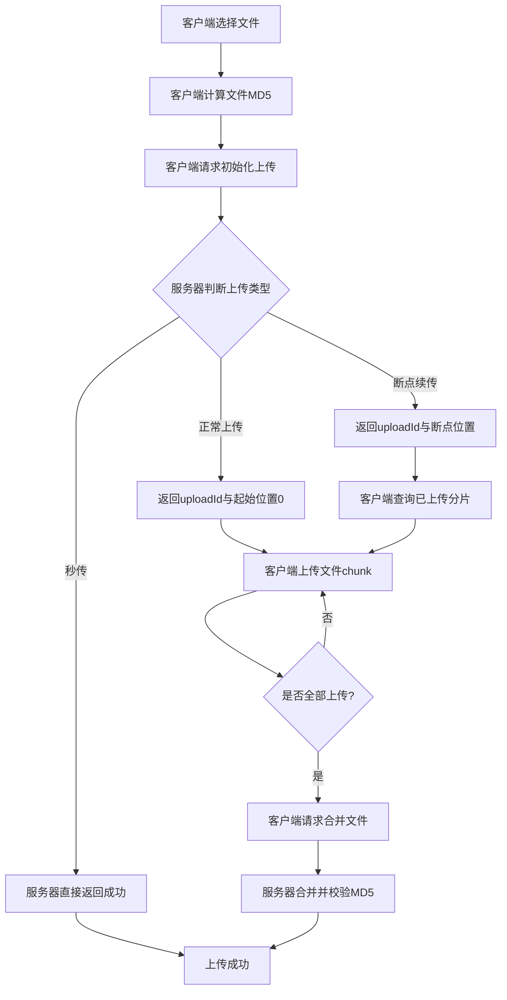
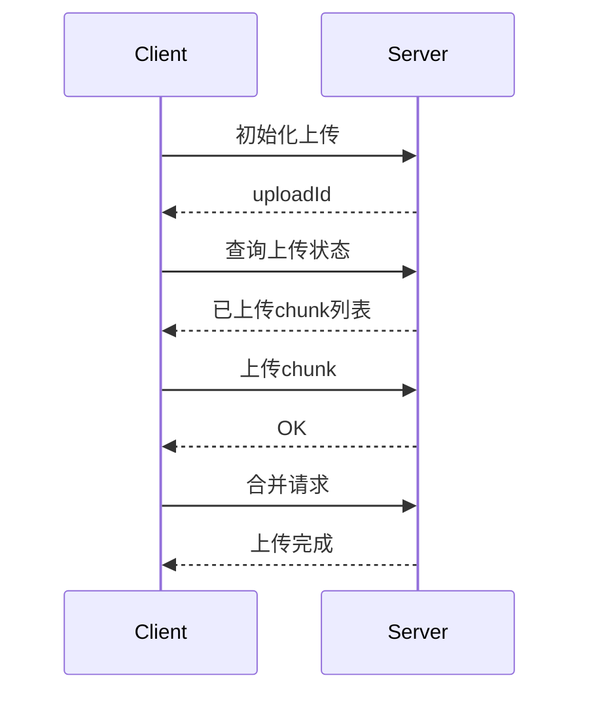

# 整体架构设计

## 上传流程图

```mermaid
flowchart TD
    A[客户端选择文件] --> B[客户端计算文件MD5]
    B --> C[客户端请求初始化上传]
    
    C --> D{服务器判断上传类型}

    D -- 秒传 --> M[服务器直接返回成功]
    M --> K[上传成功]

    D -- 正常上传 --> L[返回uploadId与起始位置0]
    L --> G[客户端上传文件chunk]

    D -- 断点续传 --> N[返回uploadId与断点位置]
    N --> F[客户端查询已上传分片]
    F --> G

    G --> H{是否全部上传?}
    H -- 否 --> G
    H -- 是 --> I[客户端请求合并文件]

    I --> J[服务器合并并校验MD5]
    J --> K[上传成功]
```

```mermaid
sequenceDiagram
    participant Client
    participant Server

    Client->>Server: 初始化上传
    Server-->>Client: uploadId

    Client->>Server: 查询上传状态
    Server-->>Client: 已上传chunk列表

    Client->>Server: 上传chunk
    Server-->>Client: OK

    Client->>Server: 合并请求
    Server-->>Client: 上传完成
```

